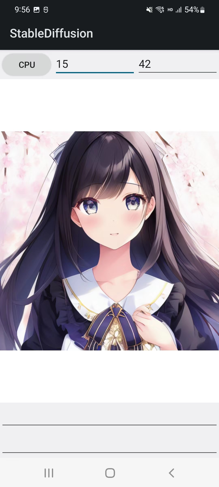

# Stable Diffusion-NCNN

English | [中文](https://github.com/EdVince/Stable-Diffusion-NCNN/blob/main/README_zh.md)

Stable-Diffusion implemented by [NCNN](https://github.com/Tencent/ncnn) framework based on C++ (Shit Mountain + Blind Box ver.)

Zhihu: https://zhuanlan.zhihu.com/p/582552276


## Usages

1. To use the model, please refer to the description of the official stable-diffusion model license, which will not be repeated here, please abide by it consciously.
2. The code only uses CPU, after adjustment, it only needs 8G RAM!!!
3. Thanks to the pr from nihui, the quality of the current output is stable (prompt must be written well, you can refer to *The Code of Quintessence*),  welcome to try.
4. Unbelievable, we offer the android apk, you can download it from the link below.


## Some Results

Note: For android APP, it needs about 7G RAM and 20s/step in Snapdragon865 (I test it by Galaxy S20 with 12G and Snapdragon865) 



## Implementation Details

1. Three main steps of Stable-Diffusion：
    1. CLIP: text-embedding
    2. iterative sampling with sampler
    3. decode the sampler results to obtain output images
2. Model details：
    1. Weights：Naifu (u know where to find)
    2. Sampler：Euler ancestral (k-diffusion version)
    3. Resolution：512*512
    4. Denoiser：CFGDenoiser, CompVisDenoiser
    4. Prompt：positive & negative, both supported :)


## Code Details

1. Since the current running speed is not so fast, the x86 exe file wasn't uploaded, please compile it yourself or try the android app.
2. All model and apk are available in [百度网盘](https://pan.baidu.com/s/1kO8HtTZRcyDbzA32ZzafSQ?pwd=6666) or [Google Drive](https://drive.google.com/drive/folders/1myB4uIQ2K5okl51XDbmYhetLF9rUyLZS?usp=sharing)
3. if you want to complie the project by yourself, please download the corresponding model and put them to the `assets` directory
4. A simple test prompt is given in this repo.


## Some Issues

1. Very sensitive to prompts, if you want to make a high quality picture, the prompt must be written well.
2. Slow, one iterative step costs about 5-10second.


## ONNX Model

I've uploaded the three onnx models used by Stable-Diffusion, so that you can do some interesting work.

You can find them from the link above.

### Statements

1. Please abide by the agreement of the stable diffusion model consciously, and DO NOT use it for illegal purposes!
2. If you use these onnx models to make open source projects, please inform me and I'll follow and look forward for your next great work :)

### Instructions

1. FrozenCLIPEmbedder

```C++
ncnn (input & output): token, multiplier, cond, conds
onnx (input & output): onnx::Reshape_0, 2271

z = onnx(onnx::Reshape_0=token)
origin_mean = z.mean()
z *= multiplier
new_mean = z.mean()
z *= origin_mean / new_mean
conds = torch.concat([cond,z], dim=-2)
```

2. UNetModel

```C++
ncnn (input & output): in0, in1, in2, c_in, c_out, outout
onnx (input & output): x, t, cc, out

outout = in0 + onnx(x=in0 * c_in, t=in1, cc=in2) * c_out
```

## References

1. [ncnn](https://github.com/Tencent/ncnn)
2. [opencv-mobile](https://github.com/nihui/opencv-mobile)
3. [stable-diffusion](https://github.com/CompVis/stable-diffusion)
4. [k-diffusion](https://github.com/crowsonkb/k-diffusion)
5. [stable-diffusion-webui](https://github.com/AUTOMATIC1111/stable-diffusion-webui)

